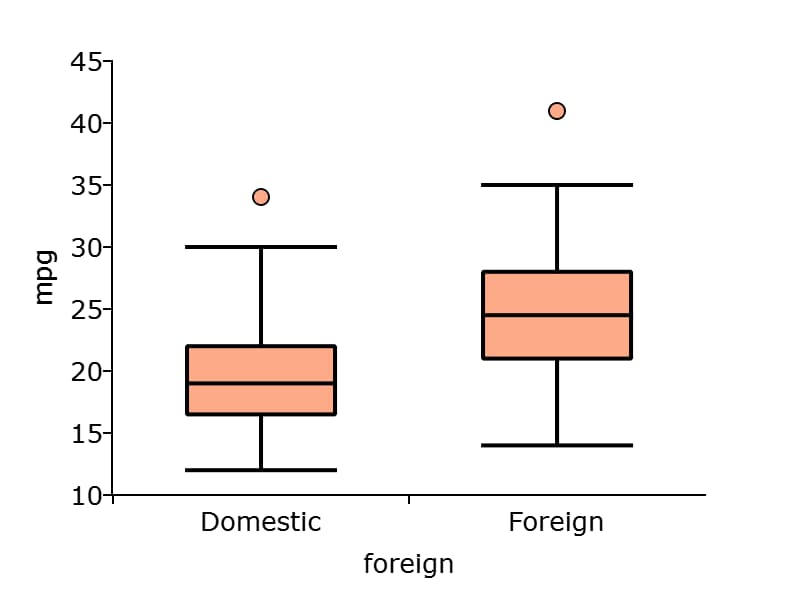

plotSetBoxWidth
==============================================

Purpose
----------------
Sets the width of the boxes in box plots.

Format
----------------
.. function:: plotSetBarWidth(&myPlot, boxWidth)

    :param &myPlot: A :class:`plotControl` structure pointer.
    :type &myPlot: struct pointer

    :param boxWidth: Width of the bars in plot set between 0 and 1. If set to 1, the bars will touch each other. Default bar width is 0.25.
    :type boxWidth: Scalar

Examples
----------------

::

  // Import data
  auto2 = loadd("C:/gauss22/examples/auto2.dta");

  // Declare plotControl structure
  // and fill in default values for box plot
  struct plotControl myPlot;
  myPlot = plotGetDefaults("box");

  // Set box width
  plotSetBoxWidth(&myPlot, 0.5);

  // Draw the two boxes
  plotBox(myPlot, auto2, "mpg~foreign");

Remarks
-------

.. include:: include/plotattrremark.rst

.. seealso:: Functions :func:`plotBox`, :func:`plotGetDefaults`, :func:`plotSetBarWidth`
