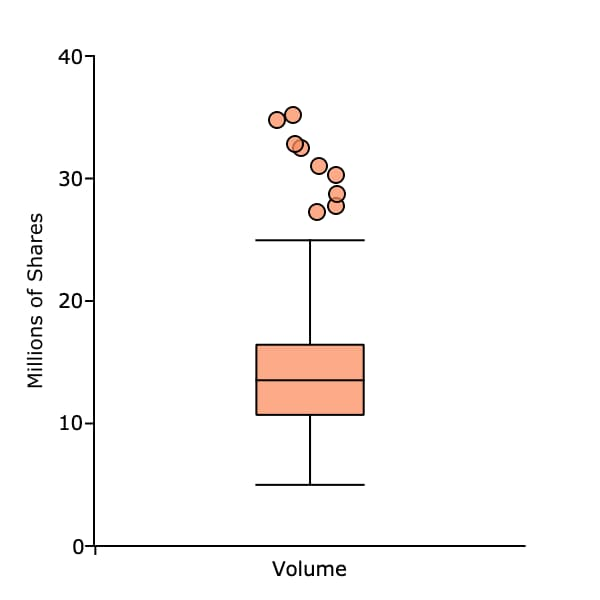
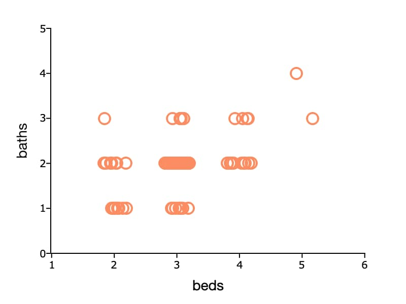

plotSetJitterRange
==============================================

Purpose
----------------

Adds a small random perturbation (jitter) to :func:`plotBox` outliers, or :func:`plotScatter` plots so that overlapping observations can be better seen.

Format
----------------
.. function:: plotSetJitterRange(&myPlot, range)

    :param &myPlot: A :class:`plotControl` structure pointer.
    :type &myPlot: struct pointer

    :param range: the jitter range. 

        For **box plots**, the allowable range is between [0.0 - 1.0], representing the percentage of the box width that jitter is allowed to occur. The default value is 0.0 (no jitter). 

        For **scatter plots**, this is a fixed value representing how far from the initial `x` value in either direction that points will be plotted. The default value is 0.0 (no jitter).

    :type range: 1xN matrix

Examples
----------------

Example 1: Overlapping outliers in a box plot
+++++++++++++++++++++++++++++++++++++++++++++++

If there are a large number of outliers in a box plot, the scatter points may overlap, making it impossible to see how many outliers there are. Our box plot below illustrates this. 

::

    // Get file name with full path
    fname = getGAUSSHome() $+ "examples/xle_daily.xlsx";

    // Load one variable from the Excel file 
    v = loadd(fname, "volume");
    
    // Declare plotControl structure
    // and fill with default settings
    struct plotControl plt;
    plt = plotGetDefaults("box");
    
    // Set outlier points to randomly
    // range 70% of the width of the box
    // in either direction
    plotSetJitterRange(&plt, 0.7);

    // Set outlier symbol to ellipses
    // with a width of 5 pixels
    plotSetLineSymbol(&plt, 0, 5);

    // Set the line thickness for the
    // box and outlier outline to 1 pixel
    plotSetLineThickness(&plt, 1);
    
    plotSetYLabel(&plt, "Millions of shares");
    
    plotBox(plt, "Volume", v ./ 1e6);

Example 2: Overlapping scatter plot
++++++++++++++++++++++++++++++++++++++

Sometimes scatter points can overlap for data with integer values. This makes it impossible to see the frequency of the data at each point. Our plot of housing data below shows this. 

::

    // Create file name with full path
    fname = getGAUSSHome() $+ "examples/housing.csv";
    
    // Load specified variables from the CSV file
    houses = loadd(fname, "beds + baths");
    
    // Declare plotControl structure
    // and fill with default settings
    struct plotControl plt;
    plt = plotGetDefaults("scatter");
    
    plotSetXTicInterval(&plt, 1);
    plotSetYTicInterval(&plt, 1);
    plotSetXRange(&plt, 1, 6);
    plotSetYRange(&plt, 0, 5);
    
    // Set X and Y axis labels
    plotSetXLabel(&plt, "beds", "helvetica neue", 14);
    plotSetYLabel(&plt, "baths");
    
    // Draw plot with applied settings
    plotScatter(plt, houses[.,"beds"], houses[.,"baths"]);

We can resolve this problem by adding a small ammount or jitter, or random perturbation to the scatter points. In the example below, the scatter points are randomly shifted up to 0.2 to the right and left. This gives us a better sense of the distribution of the data.

::

    // Create file name with full path
    fname = getGAUSSHome() $+ "examples/housing.csv";
    
    // Load specified variables from the CSV file
    houses = loadd(fname, "beds + baths");
    
    // Declare plotControl structure
    // and fill with default settings
    struct plotControl plt;
    plt = plotGetDefaults("scatter");
    
    plotSetXTicInterval(&plt, 1);
    plotSetYTicInterval(&plt, 1);
    plotSetXRange(&plt, 1, 6);
    plotSetYRange(&plt, 0, 5);
    
    // Set X and Y axis labels
    plotSetXLabel(&plt, "beds", "helvetica neue", 14);
    plotSetYLabel(&plt, "baths");

    // Add jitter along the x-axis
    plotSetJitterRange(&plt, 0.2);
    
    // Draw plot with applied settings
    plotScatter(plt, houses[.,"beds"], houses[.,"baths"]);

Remarks
-------

.. include:: include/plotattrremark.rst

.. seealso:: Functions :func:`plotGetDefaults`, :func:`plotSetBoxWidth`

