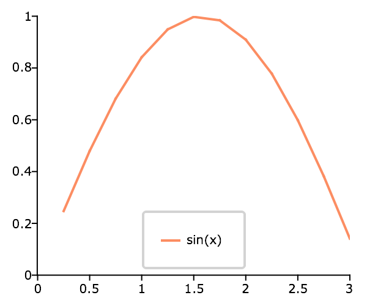

plotSetLegendBorder
==============================================

Purpose
----------------
Controls the color and thickness of the legend border.

Format
----------------
.. function:: plotSetLegendBorder(&myPlot, clr[, thickness])

    :param &myPlot: A :class:`plotControl` structure pointer.
    :type &myPlot: struct pointer

    :param clr: name or rgb value of the new color.
    :type clr: string

    :param thickness: Optional input, the thickness of the legend border in pixels.
    :type thickness: scalar

Examples
----------------

::

    // Create the sequence 0.25, 0.5, 0.75...3
    x = seqa(0.25, 0.25, 12);
    y = sin(x);
    
    // Declare plotControl structure
    // and fill with default settings for XY plots
    struct plotControl myPlot;
    myPlot = plotGetDefaults("xy");

    plotSetLegend(&myPlot, "sin(x)", 1|0.25);
    
    // Set the legend border to light gray
    // and 2 pixels thick
    plotSetLegendBorder(&myPlot, "light gray", 2);
    
    plotXY(myPlot, x, y);

Remarks
-------

* You can hide the legend border by either setting it to the background color or using :func:`plotSetLegendBkd` to make
  the legend background transparent.
* :func:`plotSetLegendBorder` is supported for use with all plot types except for PQG graphics and :func:`plotSurface`.
* This function sets an attribute in a :class:`plotControl` structure. It does not
  affect an existing graph, or a new graph drawn using the default
  settings that are accessible from the :menuselection:`Tools --> Preferences --> Graphics`
  menu. See the `GAUSS Graphics chapter <GG-GAUSSGraphics.html>`_ for more information on the
  methods available for customizing your graphs.

.. seealso:: Functions :func:`plotSetLegend`, :func:`plotSetLegendBkd`, :func:`plotSetLegendFont`

