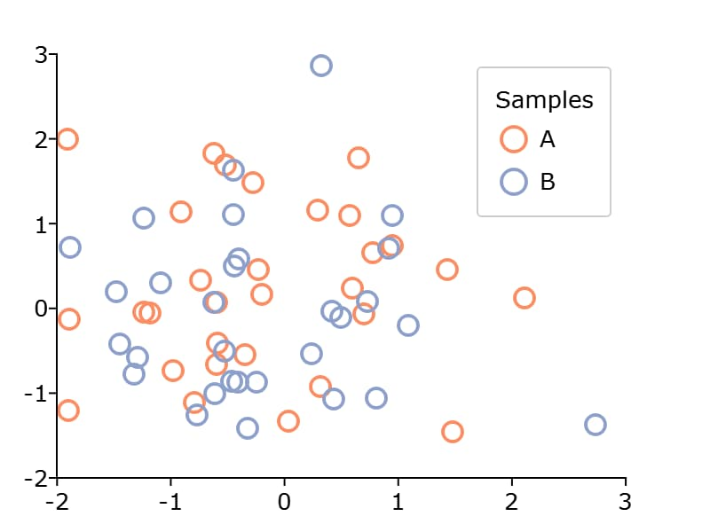

plotSetLegendTitle
==============================================

Purpose
----------------
Controls the legend title.

Format
----------------
.. function:: plotSetLegendTitle(&myPlot, title)

    :param &myPlot: A :class:`plotControl` structure pointer
    :type &myPlot: struct pointer

    :param title: Title to be displayed in the legend.
    :type title: string

Examples
----------------

::

    new;

    // Declare plotControl structure
    struct plotControl myPlot;

    // Initialize plotControl structure
    myPlot = plotGetDefaults("scatter");

    // Set labels, location, and orientation of legend
    label = "A"$|"B";
    plotSetLegend(&myPlot, label);

    // Set font of legend
    plotSetLegendTitle(&myPlot, "Samples");

    // Create data
    x = rndn(30, 2);
    y = rndn(30, 2);

    // Plot the data with the legend settings
    plotScatter(myplot, x, y);

.. seealso:: Functions :func:`plotSetLegend`, :func:`plotSetLegendBkd`, :func:`plotSetLegendFont`
