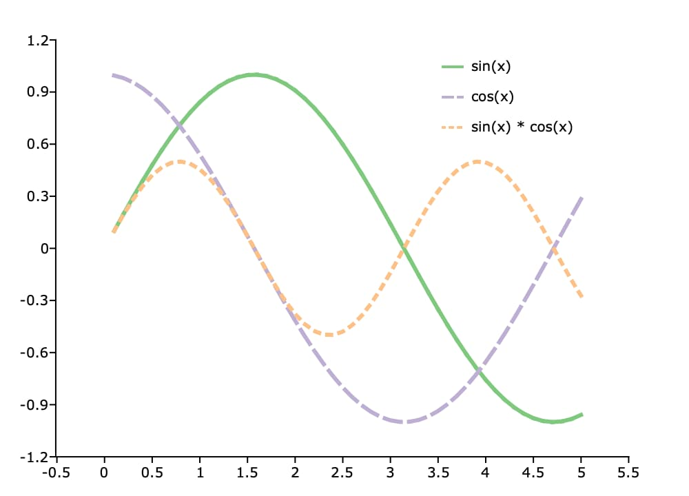

plotSetLinePen
==============================================

Purpose
----------------
Sets the color, thickness and style for the lines on an XY or contour plot.

Format
----------------
.. function:: plotSetLinePen(&myPlot, thickness[, clr[, style]])

    :param &myPlot: A :class:`plotControl` structure pointer.
    :type &myPlot: struct pointer

    :param thickness: the thickness of the line(s) in pixels.
    :type thickness: Scalar or Nx1 matrix

    :param clr: Optional argument, name or RGB value of the new color(s) for the line(s).
    :type clr: string or Nx1 string array

    :param style: Optional argument, the style(s) of the pen for the line(s). Options include:

        .. include:: include/plotpenstyletable.rst

    :type style: Scalar or Nx1 matrix

Examples
----------------

Basic example
+++++++++++++++

::

    // Declare plotControl structure
    struct plotControl myPlot;

    // Initialize plotControl structure
    myPlot = plotGetDefaults("xy");

    // Set lines to be 2 pixels wide. Set
    // the first line to be black and the second to be gray
    plotSetLinePen(&myPlot, 2, "black" $| "gray");

    // Create data
    x = seqa(0.1, 0.1, 50);
    y = sin(x) ~ cos(x);

    // Plot the data with the new line colors
    plotXY(myPlot, x, y);

Example setting all options
+++++++++++++++++++++++++++++

::

    // Declare plotControl structure
    // and fill with default settings
    struct plotControl myPlot;
    myPlot = plotGetDefaults("xy");

    /*
    ** Set XY lines to
    ** 1. Be 2 pixels wide.
    ** 2. Use the colors from the 'accent' color palette
    ** 3. Set the line styles to be solid=1, dash=2, dot=3
    */
    clrs = getColorPalette("accent");
    styles = { 1, 2, 3 };
    plotSetLinePen(&myPlot, 2, clrs, styles);

    // Create 3 series of data
    x = seqa(0.1, 0.1, 50);
    y = sin(x) ~ cos(x) ~ (sin(x) .* cos(x));

    labels = "sin(x)" $| "cos(x)" $| "sin(x) * cos(x)";
    plotSetLegend(&myPlot, labels);

    // Plot the data with the new line
    // colors, styles and thickness
    plotXY(myPlot, x, y);

Remarks
-------

.. include:: include/plotattrremark.rst

.. seealso:: Functions :func:`plotGetDefaults`, :func:`plotSetLineStyle`, :func:`plotSetXPen`, :func:`plotSetYPen`
