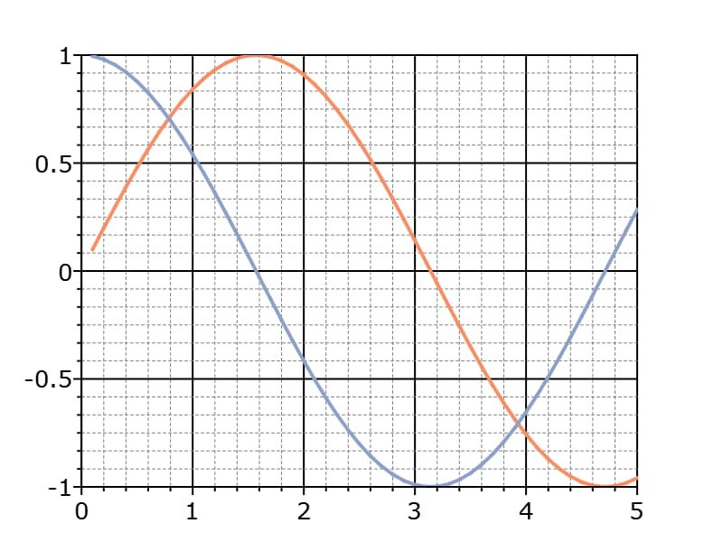

plotSetMinorGridPen
==============================================

Purpose
----------------
Sets the color, thickness and style for the axes minor grid lines.

Format
----------------
.. function:: plotSetMinorGridPen(&myPlot, thickness[, clr[, style]])

    :param &myPlot: A :class:`plotControl` structure pointer.
    :type &myPlot: struct pointer

    :param thickness: the thickness of the x-axis minor grid lines in pixels.
    :type thickness: Scalar

    :param clr: Optional argument, name or rgb value of the new color for the x-axis minor grid lines.
    :type clr: string

    :param style: the style of the pen. Options include:

        .. include:: include/plotpenstyletable.rst

    :type style: Scalar

Examples
----------------

::

  // Declare plotControl structure
  struct plotControl myPlot;

  // Initialize plotControl structure
  myPlot = plotGetDefaults("xy");

  // Turn on x-axis and y-axis minor grid
  plotSetGrid(&myPlot, "both")

  // Set minor tick counts for axes
  plotSetXMinorTicCount(&myPlot, 4);
  plotSetYMinorTicCount(&myPlot, 5);

  // Set major axes grid lines to be 1 pixel wide and black
  plotSetGridPen(&myPlot, 1, "black");

  // Set minor axes to be 0.5 pixels wide, grey, and dashed
  plotSetMinorGridPen(&myPlot, 0.5, "grey", 2);

  // Create data
  x = seqa(0.1, 0.1, 50);
  y = sin(x)~cos(x);

  // Plot the data with
  plotXY(myPlot, x, y);

Remarks
-------
- The axes minor grid lines must turned on using :func:`plotSetGrid` for the minor axes to show.
- The x-axis minor grid tick count must be set using :func:`plotSetXMinorTicCount` for the minor x-axis to show.
- The y-axis minor grid tick count must be set using :func:`plotSetYMinorTicCount` for the minor y-axis to show.
- The x-axis minor grid is unsupported for bar, box, and histogram plots at this time.

.. include:: include/plotattrremark.rst

.. seealso:: Functions :func:`plotSetGrid`, :func:`plotSetXMinorTicCount`, :func:`plotSetYMinorTicCount`, :func:`plotSetYMinorGridPen`, :func:`plotSetXMinorGridPen`
