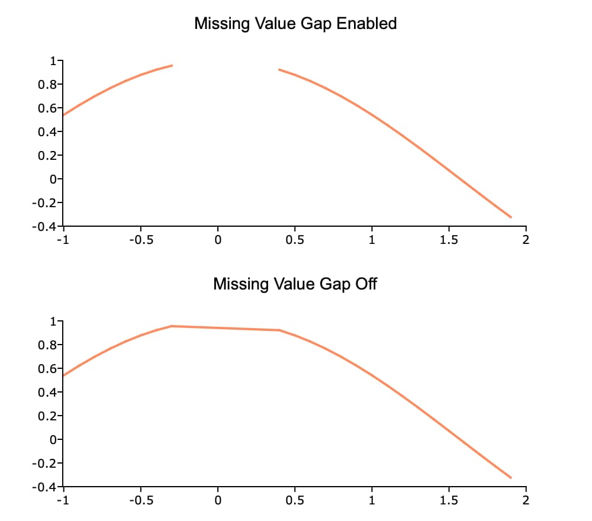

plotSetMissGap
==============================================

Purpose
----------------
Controls whether missing data creates a gap in line plots, or is ignored.

Format
----------------
.. function:: plotSetMissGap(&myPlot, is_on)

    :param &myPlot: A :class:`plotControl` structure pointer.
    :type &myPlot: struct pointer

    :param is_on: A setting of 1 or ``"on"`` will cause gaps at missing values. 0 or ``"off"`` will cause line plots to ignore elements with missing values.
    :type is_on: Scalar, or string

Examples
----------------

::

    x = seqa(-1, 0.1, 30);
    y = cos(x);
    
    // Set the 9th to 14th elements
    // of 'y' to be a missing value
    y[9:14] = miss(0,0);
    
    // Declare plotControl structure
    // and fill with default settings
    struct plotControl plt;
    plt = plotGetDefaults("xy");
    
    plotSetTitle(&plt, "Missing Value Gap Enabled", "Arial", 14);
    
    // Create 2x1 graph layout and place
    // the first graph in the first location
    plotLayout(2, 1, 1);
    
    // Draw the first plot
    plotXY(plt, x, y);
    
    // Place the next plot in the second location
    plotLayout(2, 1, 2);
    
    plotSetTitle(&plt, "Missing Value Gap Off");
    
    // Turn off the missing gap
    plotSetMissGap(&plt, "off");
    
    // Draw second plot
    plotXY(plt, x, y);

Remarks
-------

-  :func:`plotSetMissGap` will draw a straight line between the point before and after the missing value.

.. include:: include/plotattrremark.rst

.. seealso:: Functions :func:`miss`, :func:`impute`, :func:`packr`
