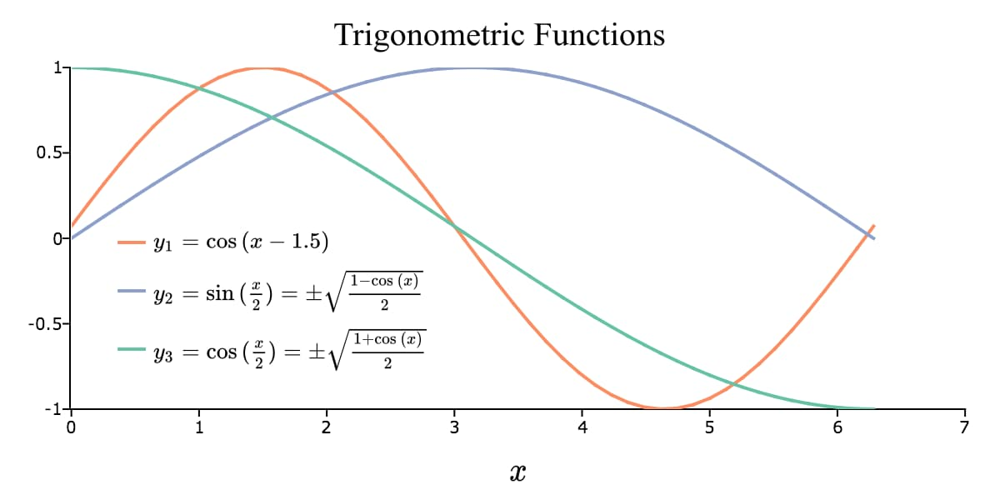

plotSetTextInterpreter
==============================================

Purpose
----------------
Controls the text interpreter settings for a graph.

Format
----------------
.. function:: plotSetTextInterpreter(&myPlot, interpreter[, location])

    :param &myPlot: A :class:`plotControl` structure pointer.
    :type &myPlot: struct pointer

    :param interpreter: ``"html"``, ``"plain"``, ``"latex"``.
    :type interpreter: string

    :param location: Optional argument, which attributes the interpreter change applies to :

        **Valid options:**

        .. list-table::
            :widths: auto
    
            * - "all" (default)
            * - "legend"
            * - "legend_title"
            * - "title"
            * - "axes"
            * - "xaxis"
            * - "xtop"
            * - "xbottom"
            * - "yaxis"
            * - "yleft"
            * - "yright"

    :type location: string

Examples
----------------

Plain interpreter
+++++++++++++++++

The HTML text interpreter treats certain characters, such as greater-than and less-than signs, as mark-up rather than literal text to display. The Plain
text interpretor will allow you to use these symbols directly in your plot text labels.

::

    new;

    // Declare plotControl structure
    struct plotControl myPlot;

    // Initialize plotControl structure
    myPlot = plotGetDefaults("hist");

    // Set the interpreter of axes
    plotSetTextInterpreter(&myPlot, "plain", "axes");

    // Set the x-axis label, using the > character which would
    // would fail with the default HTML interpreter.
    plotSetXLabel(&myPlot, "Weight > 50 Kg");

    // Create data
    x = rndn(1e5, 1);

    // Plot a histogram of the x data spread over 50 bins
    plotHist(myPlot, x, 50);

HTML interpreter
++++++++++++++++

You may add Greek letters, mathematical symbols, subscript and superscript to your title, axes and legend using HTML. To add HTML to a label, you can use :func:`plotSetTextInterpreter` to set "html" for the text to be interpreted as HTML.

::

    // Set the interpreter of axes
    plotSetTextInterpreter(&myPlot, "html", "axes");

    label_string = "&beta;";

    // Set the x-axis label
    plotSetXLabel(&myPlot, label_string);

The code above will add the letter :math:`\beta` to the graph title. The HTML 'sup' tag will create superscript and the 'sub' tag will create subscript. For example:

::

    label_string = "&sigma;2";

    // Set the x-axis label
    plotSetXLabel(&myPlot, label_string);

will add :math:`\sigma^2` to your title. While,

::

    label_string = "Yt-1";

    // Set the x-axis label
    plotSetXLabel(&myPlot, label_string);

will create :math:`Y_{t-1}`.

LaTeX Interpreter
+++++++++++++++++

You can also use LaTeX to add complex math expression, or non-Latin scripts to your title, axes, and legend. You can use :func:`plotSetTextInterpreter` to set "latex"for the text to be interpreted as LaTeX.

::

    new;
    
    // Declare plotControl structure
    // and fill with default XY settings
    struct plotControl myPlot;
    myPlot = plotGetDefaults("xy");
    
    // Set LaTeX text interpreter for all text on plot
    plotSetTextInterpreter(&myPlot, "latex", "all");
    
    font_name = "Times New Roman";
    
    // Set up x-axis label
    plotSetXLabel(&myPlot, "x", font_name, 20);
    
    // Set LaTeX legend string
    string legend_string = {
    "y_1 = \\cos{(x - 1.5)}",
    "y_2 = \\sin{(\\frac{x}{2})} = \\pm \\sqrt{\\frac{1-\\cos{(x)}}{2}}",
    "y_3 = \\cos{(\\frac{x}{2})} = \\pm \\sqrt{\\frac{1+\\cos{(x)}}{2}}"};
    
    plotSetLegend(&myPlot, legend_string, "bottom left inside", 1);
    plotSetLegendBkd(&myPlot, 0);
    plotSetLegendFont(&myPlot, font_name, 12);
    
    // Set up title
    title_string = "\\text{Trigonometric Functions}";
    plotSetTitle(&myPlot, title_string, font_name, 18);
    
    // Create data
    n = 50;
    x = seqa(0,(2*pi)/(n-1), n);
    
    // Specify size of plot canvas
    plotCanvasSize("px", 600 | 300);
    
    // Draw plot
    plotXY(myPlot, x, cos(x-1.5)~sin(x/2)~cos(x/2));

The plot is

Remarks
-------

When the text interpreter is set to use LaTeX:

-  Since backslashes inside of a string represent the escaping of a
   character, use double backslashes to represent a backslash.
-  The default mode is that of an in-line equation. To add a section of
   strictly text, wrap the text only section in ``\\text{}``. For example:

   ::

      "\\text{The formula is } \\alpha + \\beta_1 X + \\epsilon"

-  Text outside of a ``\\text{}`` section will use the TeX font. Text inside
   of a ``\\text{}`` section will use whatever font was specified for the
   label.

The ``plain`` text interpreter will allow you to pass in characters that
would be invalid HTML, such as the symbols '``<``' and '``>``'.

.. include:: include/plotattrremark.rst

.. seealso:: Functions :func:`plotGetDefaults`, :func:`plotSetYLabel`, :func:`plotSetXLabel`, :func:`plotSetTitle`, :func:`plotSetLegend`

