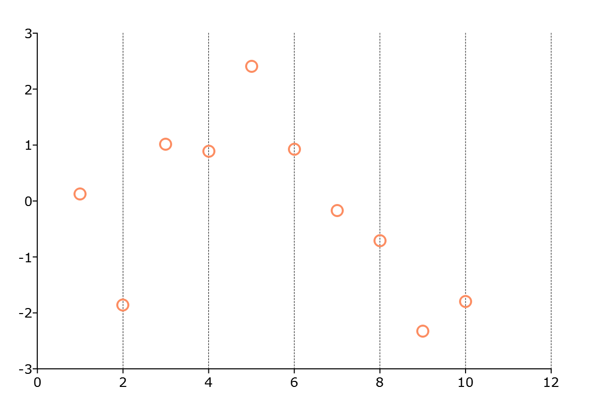

plotSetXGridPen
==============================================

Purpose
----------------
Controls the thickness, color, and style for the x-axis major grid lines.

Format
----------------
.. function:: plotSetXGridPen(&myPlot, thickness[, clr[, style]])

    :param &myPlot: A :class:`plotControl` structure pointer.
    :type &myPlot: struct pointer

    :param thickness: the thickness of the x-axis major grid lines in pixels.
    :type thickness: Scalar

    :param clr: Optional argument, name or rgb value of the new color for the x-axis major grid lines.
    :type clr: string

    :param style: the style of the pen. Options include:

        .. include:: include/plotpenstyletable.rst

    :type style: Scalar

Examples
----------------

::

    // Declare plotControl structure
    struct plotControl myPlot;

    // Initialize plotControl structure
    myPlot = plotGetDefaults("scatter");

    // Set grid to on the x-axis major ticks only
    plotSetXGrid(&myPlot, "major");

    // Set grid line to be 0.5 px, black, and dashed
    plotSetXGridPen(&myPlot, 0.5, "Black", 2);

    // Create a scatter plot of random data
    plotScatter(myPlot, seqa(1, 1, 10 ), rndn(10, 1));

Remarks
-------
Please note that :func:`plotSetXGridPen` is not supported for bar, box, or histogram plots.

.. include:: include/plotattrremark.rst

.. seealso:: Functions :func:`plotSetXGrid`, :func:`plotSetYGridPen`, :func:`plotSetGridPen`
