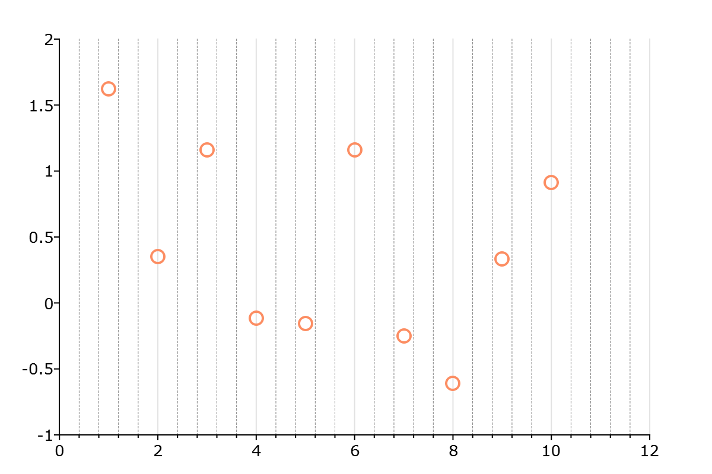

plotSetXMinorGridPen
==============================================

Purpose
----------------
Controls the thickness, color, and style for the minor X-axis grid lines.

Format
----------------
.. function:: plotSetXMinorGridPen(&myPlot, thickness[, clr[, style]])

    :param &myPlot: A :class:`plotControl` structure pointer.
    :type &myPlot: struct pointer

    :param thickness: the thickness of the axis line in pixels.
    :type thickness: Scalar

    :param clr: Optional argument, name or rgb value of the new color for the axes.
    :type clr: string

    :param style: the style of the pen. Options include:

        .. include:: include/plotpenstyletable.rst

    :type style: Scalar

Examples
----------------

::

    // Declare plotControl structure
    struct plotControl myPlot;

    // Initialize plotControl structure
    myPlot = plotGetDefaults("scatter");

    // Set X-axis major and minor grid lines on
    plotSetXGrid(&myPlot, "both");

    // Set X-axis minor grid lines tic count
    plotSetXMinorTicCount(&myPlot, 4);

    // Set X-axis minor grid lines to be 0.5 pixels thick,
    // grey, and dashed
    plotSetXMinorGridPen(&myPlot, 0.5, "grey", 2);

    // Create a scatter plot of random data
    plotScatter(myPlot, seqa(1, 1, 10 ), rndn(10, 1));

    // Turn off the grid
    plotSetGrid(&myPlot, "off");

Remarks
---------
- The X-axis minor grid tick count must be set using :func:`plotSetXMinorTicCount` for the axis to show.
- The X-axis minor grid is unsupported for bar, box, and histogram plots at this time.

.. include:: include/plotattrremark.rst

.. seealso:: Functions :func:`plotSetXGridPen`, :func:`plotSetXMinorTicCount`, :func:`plotSetYMinorGridPen`, :func:`plotSetAxesMinorGridPen`
