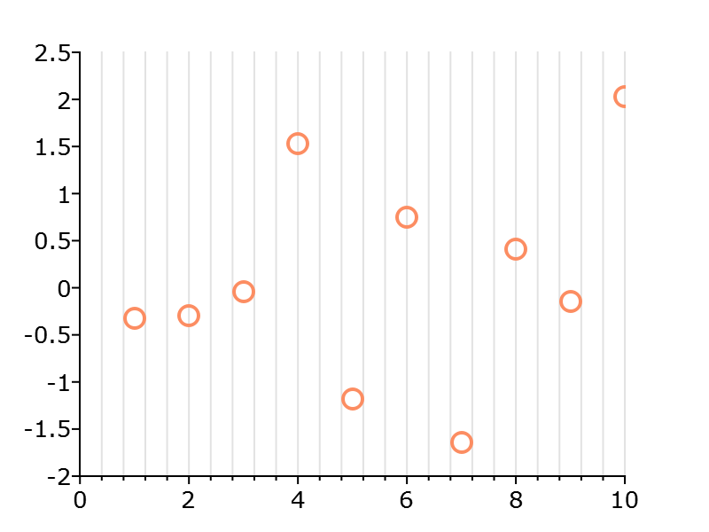

plotSetXMinorTicCount
==============================================

Purpose
----------------
Controls the number of minor ticks to place between major ticks on the x-axis of a 2-D plot.

Format
----------------
.. function:: plotSetXMinorTicCount(&myPlot, num_tics)

    :param &myPlot: A :class:`plotControl` structure pointer.
    :type &myPlot: struct pointer

    :param num_tics: the number of minor ticks to place between major ticks on the x-axis.
    :type num_tics: Scalar

Examples
----------------

::

  // Declare plotControl structure
  struct plotControl myPlot;

  // Initialize plotControl structure
  myPlot = plotGetDefaults("scatter");

  // Set x-axis major and minor grid lines on
  plotSetXGrid(&myPlot, "both");

  // Set x-axis minor grid lines tick count
  plotSetXMinorTicCount(&myPlot, 4);

  // Create a scatter plot of random data
  plotScatter(myPlot, seqa(1, 1, 10 ), rndn(10, 1));

Remarks
-------
- The x-axis minor grid must turned on using :func:`plotSetXGrid` or :func:`plotSetGrid` for the minor axis to show.
- The x-axis minor grid is unsupported for bar, box, and histogram plots at this time.

    .. include:: include/plotattrremark.rst

    .. seealso:: Functions :func:`plotSetXGrid`, :func:`plotSetXGridPen`, :func:`plotSetXMinorGridPen`, :func:`plotSetYMinorTicCount`
