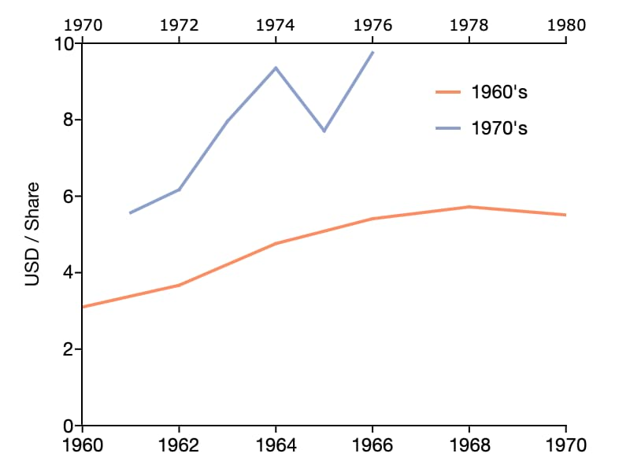

plotSetXRange
==============================================

Purpose
----------------
Sets the range for the x-axis.

Format
----------------
.. function:: plotSetXRange(&myPlot, x_min, x_max [, tic_interval, first_labeled])
              plotSetXRange(&myPlot, x_min, x_max [, tic_interval, time_unit, first_labeled])

    :param &myPlot: A :class:`plotControl` structure pointer.
    :type &myPlot: struct pointer

    :param x_min: minimum limit of the x-axis. 
    :type x_min: Scalar, or 2x1 matrix

    :param x_max: maximum limit of the x-axis.
    :type x_max: Scalar, or 2x1 matrix

    :param tic_interval: Optional input, the distance between x-axis tick labels.
    :type tic_interval: scalar

    :param time_unit: Optional input used for time series plots. The time units to describe the ``tic_interval`` input:

        - "milliseconds"
        - "seconds"
        - "minutes"
        - "hours"
        - "days"
        - "months"
        - "quarters"
        - "years"

    :type time_unit: string

    :param first_labeled: Optional input, the value of the first X value on which to place a tick label.
    :type first_labeled: scalar

Examples
----------------

Basic usage
+++++++++++++++

::

    // Declare plotControl structure
    struct plotControl myPlot;

    // Initialize plotControl structure
    myPlot = plotGetDefaults("scatter");

    // Set x-axis to to range from -5 to +5
    plotSetXRange(&myPlot, -5, 5);

    // Create and plot data using our x-range
    x = rndn(100, 1);
    y = rndn(100, 1);

    plotScatter(myPlot, x, y);

Set separate ranges for the top and bottom x-axes
+++++++++++++++++++++++++++++++++++++++++++++++++++

We will create the plot shown above, comparing S&P 500 earnings data from two decades by plotting one of the series against the bottom x-axis and the other against the top x-axis. 

The call to :func:`plotSetWhichXAxis` below specifies that the first column plotted will be assigned to the bottom x-axis, while the second column plotted will be plotted against the top x-axis.

::

    // Declare plotControl structure
    // and apply default settings
    struct plotControl myPlot;
    myPlot = plotGetDefaults("xy");
    
    // S&P500 earnings data
    y60s = { 1960, 1962, 1964, 1966, 1968, 1970 };
    y70s = { 1971, 1972, 1973, 1974, 1975, 1976 };
    
    earn60s = { 3.1, 3.67, 4.76, 5.41, 5.72, 5.51 };
    earn70s = { 5.57, 6.17, 7.96, 9.35, 7.71, 9.75 };
    
    // Set the range for the bottom x-axis from 1960 to 1970
    // and set the range for the top x-axis from 1970 to 1980
    x_min = { 1960, 1970 };
    x_max = { 1970, 1980 };
    plotSetXRange(&myPlot, x_min, x_max);
    
    // Assign the 1st column (which will be the 1960's data) to the bottom x-axis.
    // Assign the 2nd column (1970's data) to the top x-axis
    plotSetWhichXAxis(&myPlot, "bottom" $| "top");
    
    plotSetLegend(&myPlot, "1960's"$|"1970's");
    
    plotSetYRange(&myPlot, 0, 10);
    plotSetYLabel(&myPlot, "USD / Share");
    
    // Draw plot with 60's data as the first column and 
    // the 70's data second to be consistent with the
    // above call to plotSetWhichXAxis
    plotXY(myPlot, y60s~y70s, earn60s~earn70s);

Remarks
-------

-  If ``x_min`` or ``x_max`` are scalar values, they will apply to the top and bottom x-axis. If they are 2x1 matrices, the first element will control
   the bottom x-axis and the second will control the top x-axis. 

.. include:: include/plotattrremark.rst

.. seealso:: Functions :func:`plotSetXShow`, :func:`plotSetYRange`

