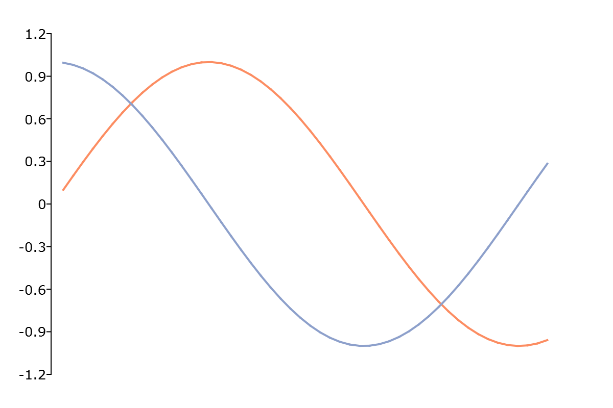

plotSetXShow
==============================================

Purpose
----------------
Hides or enables the display of the x-axis.

Format
----------------
.. function:: plotSetXShow(&myPlot, is_on)

    :param &myPlot: A :class:`plotControl` structure pointer.
    :type &myPlot: struct pointer

    :param is_on: A 0 to hide the x-axis, or a 1 to show it.
    :type is_on: Scalar, or 2x1 matrix

Examples
----------------

::

    // Declare plotControl structure
    struct plotControl myPlot;

    // Initialize plotControl structure
    myPlot = plotGetDefaults("xy");

    // Turn off the bottom x-axis
    plotSetXShow(&myPlot, 0);

    // Create data
    x = seqa(0.1, 0.1, 50);
    y = sin(x)~cos(x);

    // Plot the data
    plotXY(myPlot, x, y);

Remarks
-------

-  :func:`plotSetXShow` will not force an axis to be shown unless a series of data is attached to it. By default, data will be attached to the bottom x-axis.
   Use :func:`plotSetWhichXAxis` to control which x-axis a series of data is attached to.
-  If ``is_on`` is a scalar, it will apply to the top and bottom x-axis. If it is a 2x1 matrix, the first element will control
   the bottom x-axis and the second will control the top x-axis.

.. include:: include/plotattrremark.rst

.. seealso:: Functions :func:`plotGetDefaults`, :func:`plotSetXRange`
