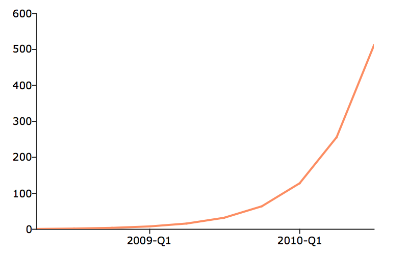

plotSetXTicInterval
==============================================

Purpose
----------------
Controls the interval between x-axis tick labels and also allows the user to specify the first tick to be labeled for 2-D graphs.

Format
----------------
.. function:: plotSetXTicInterval(&myPlot, ticInterval[, firstLabeled])
              plotSetXTicInterval(&myPlot, ticInterval[, time_unit, firstLabeled])

    :param &myPlot: A :class:`plotControl` structure pointer.
    :type &myPlot: struct pointer

    :param ticInterval: the distance between x-axis tick labels.
    :type ticInterval: scalar

    :param time_unit: Optional input used for time series plots. The time units to describe the ``ticInterval`` input:

        - "milliseconds"
        - "seconds"
        - "minutes"
        - "hours"
        - "days"
        - "months"
        - "quarters"
        - "years"

    :type time_unit: string

    :param y: Each column contains the Y values for a particular line.

    :param firstLabeled: Optional input, the value of the first X value on which to place a tick label.
    :type firstLabeled: scalar

Examples
----------------

XY plot
+++++++

::

    // Create the sequence 0.25, 0.5, 0.75...3
    x = seqa(0.25, 0.25, 12);
    y = sin(x);

    // Declare plotControl structure
    // and fill with default settings for XY plots
    struct plotControl myPlot;
    myPlot = plotGetDefaults("xy");

    // Place the first X-tick label at 0.5
    // and place additional ticks every 0.25 after
    plotSetXTicInterval(&myPlot, 0.25, 0.5);

    // Draw plot with applied X-tick settings
    plotXY(myPlot, x, y);

Scalar starting date
++++++++++++++++++++

.. figure:: _static/images/psxti1.png
    :scale: 50%

::

    // Declare and initialize plotControl structure
    struct plotControl myPlot;
    myPlot = plotGetDefaults("xy");

    // Place one tick label every 4 x-values
    ticInterval = 4;
    plotSetXTicInterval(&myPlot, ticInterval);

    // Start the time series in April of 2008
    dtstart = 200804;

    // Specify quarterly data
    frequency = 4;

    // Create the multiplicative sequence 1, 2, 4, 8...
    y = seqm(1, 2, 10);

    // Create a time series plot of the data.
    plotTS(myPlot, dtstart, frequency, y);

If you would like to change the tick labels so that they start on the first full year, 2009, continuing with the example from above, execute the following lines:

::

    // Set the optional 'firstLabeled' parameter
    plotSetXTicInterval(&myPlot, ticInterval, 2009);
    plotTS(myPlot, dtstart, frequency, y);

This new plot should now have tick labels only on the first quarters of each year:

Daily data with full time vector
++++++++++++++++++++++++++++++++

::

    // Create a time series plot of the data.
    plotXY(myPlot, date_vec, closing_price);
    fname = getGAUSSHome() $+ "examples/xle_daily.xlsx";

    // Load all observations from variables,
    // 'Date' and 'Adj Close'
    data = loadd(fname, "date(Date) + Adj Close");

    // Declare 'myPlot' to be a plotControl structure
    // and fill with default settings for XY plots
    struct plotControl myPlot;
    myPlot = plotGetDefaults("xy");

    // Draw the first X-tick label at July 2017
    // Draw a new X-tick label every 3 months
    plotSetXTicInterval(&myPlot, 3, "months", "2017-07");

    // Create a time series plot of the data
    // using a formula string
    plotXY(myPlot, data, "Adj Close ~ Date");

.. figure:: _static/images/psxti3.png
    :scale: 50%

Let's keep the tick labels on the same locations, however, create 1 tick label every quarter, instead of every 3 months. The following code will accomplish this.

::

    // Draw the first X-tick label at July 2017
    // Draw a new X-tick label every 1 label_unit,
    // which is 'quarters' in this case
    plotSetXTicInterval(&myPlot, 1, 201707);

    label_unit = "quarters";

    // Create a time series plot of the data.
    plotTS(myPlot, date_vec, label_unit, closing_price);

.. figure:: _static/images/psxti4.png
    :scale: 50%

Remarks
-------

:func:`plotSetXTicInterval` is supported for use with XY, Scatter, Contour and
time series plots. It is ignored by other plot types.

.. include:: include/plotattrremark.rst

.. seealso:: Functions :func:`dttostr`, :func:`strtodt`, :func:`plotSetXLabel`, :func:`plotSetXTicLabel`, :func:`plotSetTicLabelFont`

