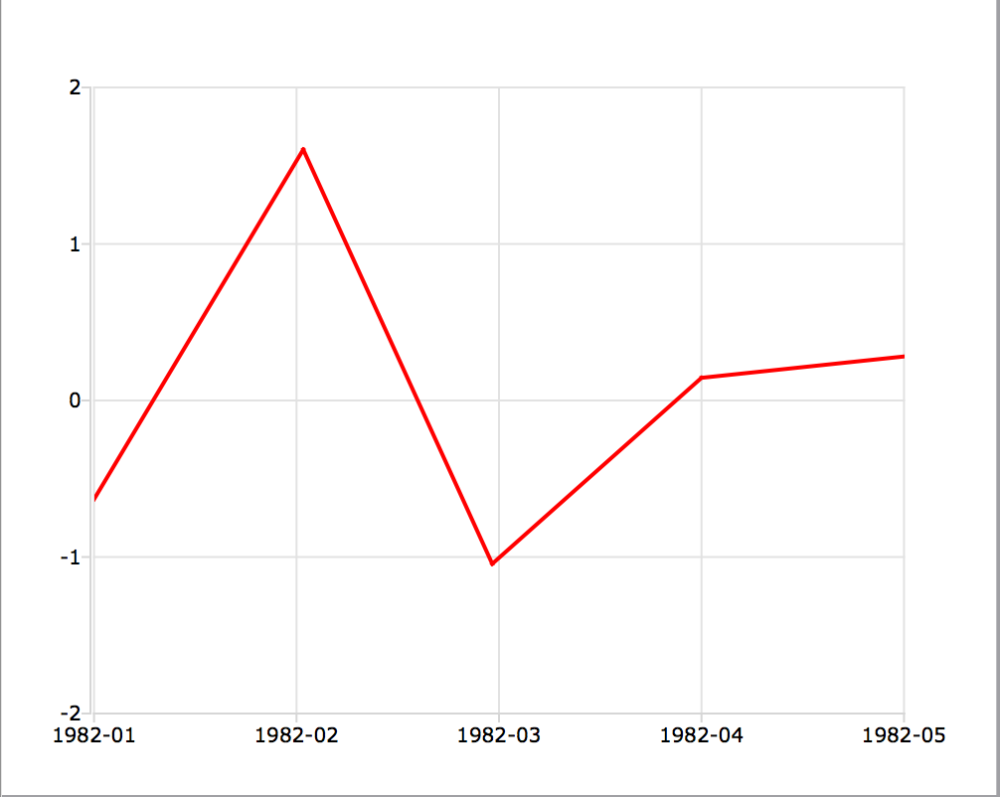

plotSetXTicLabel
==============================================

Purpose
----------------
Controls the formatting and angle of X-axis tick labels for 2-D graphs.

Format
----------------
.. function:: plotSetXTicLabel(&myPlot, fmt[, angle])

    :param &myPlot: A :class:`plotControl` structure pointer.
    :type &myPlot: struct pointer

    :param fmt: the desired formatting for the X-axis tick labels.

        - Time series graphs use the same formatting type as function :func:`dttostr`.
        - Other graph types use a :func:`sprintf` style formatting string. See Remarks below for more details.

    :type fmt: string

    :param angle: Optional argument, the angle in degrees at which to display the X-axis tick labels.
    :type angle: scalar

Examples
----------------

Time series
+++++++++++

::

    // Declare and initialize plotControl structure
    struct plotControl myPlot;
    myPlot = plotGetDefaults("xy");

    y = rndn(5, 1);

    plotSetXTicLabel(&myPlot, "YYYY-MO");

    // Start the series in January 1982
    dtstart = 198201;

    // Specify the data to be monthly
    frequency = 12;

    // Draw the time series plot
    plotTS(myPlot, dtstart, frequency, y);

The code above produces a graph with X-tick labels like the image below:

    X-tick labels

Changing to format string to ``"MO/YYYY"`` will change the labels to appear like this:

::

    01/1982

Changing to format string to ``"YYYY-QQ"`` will change the labels to appear like this:

::

    1982-Q1

Other than time series
++++++++++++++++++++++

::

    // Declare and initialize plotControl structure
    struct plotControl myPlot;
    myPlot = plotGetDefaults("xy");

    x = seqa(0.015, 0.015, 10);
    y = cos(x.^2);

    plotSetXTicLabel(&myPlot, "%.3f");

    // Draw the graph, using our format specifier
    plotXY(myPlot, x, y);

The code above produces a graph with X-tick labels like the image below:

    XY formatted label

Remarks
-------

Time series format specifier
++++++++++++++++++++++++++++

-  The following format specifiers are supported for the second input to
   :func:`plotSetXTicLabel`, *fmt* when the plot will be drawn with :func:`plotTS`:

   +-----------------+-----------------------------------------------------+
   |    YYYY         | 4 digit year                                        |
   +-----------------+-----------------------------------------------------+
   |    YR           | Last two digits of year                             |
   +-----------------+-----------------------------------------------------+
   |    QQ           | Quarter of the year. This is calculated from the    |
   |                 | month number.                                       |
   +-----------------+-----------------------------------------------------+
   |    MO           | Number of month, 01-12                              |
   +-----------------+-----------------------------------------------------+
   |    DD           | Day of month, 01-31                                 |
   +-----------------+-----------------------------------------------------+
   |    HH           | Hour of day, 00-23                                  |
   +-----------------+-----------------------------------------------------+
   |    MI           | Minute of hour, 00-59                               |
   +-----------------+-----------------------------------------------------+
   |    SS           | Second of minute, 00-59                             |
   +-----------------+-----------------------------------------------------+

-  Extra text may be added to a time series X-tick label, by enclosing
   it in single-ticks. For example,

   ::

      plotSetXTicLabel(myPlot, "HH:MI 'PM'");

   would add the text ``PM`` to the end of the X-tick label, like this:
   12:30 PM, or 02:15 PM. Note that the single-tick marks are not
   included as part of the label.

-  To learn more about DT scalar format, see **Date and Time Formats**,
   Section 1.0.1, or the functions :func:`dttostr` and :func:`strtodt`

Format specifier for other graph types
++++++++++++++++++++++++++++++++++++++

Graph types other than time series use a :func:`sprintf` style format string.
The parameters of the format string are:

-  precision - a literal scalar numeral, the number of digits after the
   decimal point
-  format type - one of the following letters:

   == ====================
   d  integer
   e  scientific notation
   f  floating point/decimal
   g  either scientific or decimal, whichever is most compact
   == ====================

The format of the format string is:

::

   "%.<precision><format type>"

Below are some examples of different format strings and how they would
represent :math:`\pi`

======= ===========
"%.2f"  3.14
"%.4f"  3.1415
"%.2e"  3.14e+00
"%.2g"  3.14
"%d"    3
======= ===========

.. include:: include/plotattrremark.rst

.. seealso:: Functions :func:`dttostr`, :func:`strtodt`, :func:`plotSetXLabel`, :func:`plotSetXTicInterval`, :func:`plotSetTicLabelFont`

