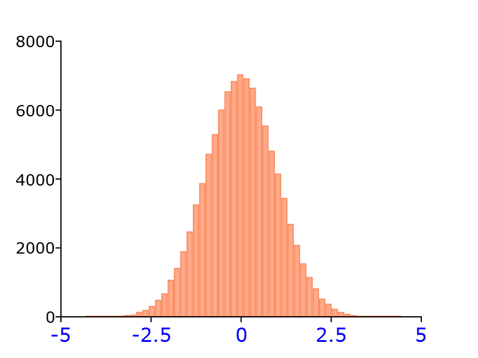

plotSetXTicLabelFont
==============================================

Purpose
----------------

Controls the settings for font style, size, and color of the x-axis tick labels on a graph.

Format
----------------
.. function:: plotSetXTicLabelFontLabel(&myPlot, font [, fontSize[, fontColor]])

    :param &myPlot: A :class:`plotControl` structure pointer.
    :type &myPlot: struct pointer

    :param font: Font or font family name.
    :type font: string

    :param fontSize: Optional argument, font size in points.
    :type fontSize: scalar

    :param fontColor: Optional argument, named color or RGB value.
    :type fontColor: string

Examples
----------------

::

  // Declare plotControl structure
  struct plotControl myPlot;

  // Initialize plotControl structure
  myPlot = plotGetDefaults("hist");

  // Set the x-axis label font, label font size, and
  // label color
  plotSetXTicLabelFont(&myPlot, "Arial", 12, "blue");

  // Create data
  x = rndn(1e5,1);

  // Plot a histogram of the x data spread over 50 bins
  plotHist(myPlot, x, 50);

Remarks
-------

.. include:: include/plotattrremark.rst

.. seealso:: Functions :func:`plotGetDefaults`, :func:`plotSetXTicInterval`, :func:`plotSetXTicLabel`, :func:`plotSetYLabel`, :func:`plotSetZLabel`, :func:`plotSetLineColor`, :func:`plotSetGrid`
