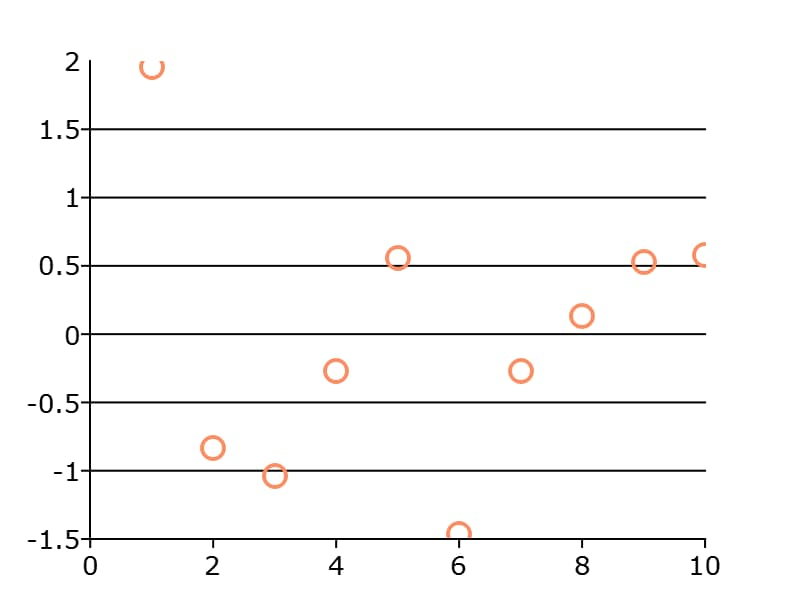

plotSetYGrid
==============================================

Purpose
----------------
Controls the settings for the background grid of a plot on the Y-Axis.

Format
----------------
.. function:: plotSetYGrid(&myPlot, tickStyle[, color])
              plotSetYGrid(&myPlot, onOff)

    :param &myPlot: A :class:`plotControl` structure pointer.
    :type &myPlot: struct pointer

    :param tickStyle: specifies whether grid marks should be drawn on major tick marks. Options: [``"major"``, ``"minor"``, ``"both"``].
    :type tickStyle: string

    :param color: Optional argument, name or rgb value of the new color.
    :type color: string

    :param onOff: turns the grid on or off. Options: [``"on"``, ``"off"``]. If used, this must be the only argument passed to the function besides the :class:`plotControl` structure pointer.
    :type onOff: string

Examples
----------------

::

    // Declare plotControl structure
    struct plotControl myPlot;

    // Initialize plotControl structure
    myPlot = plotGetDefaults("scatter");

    // Set grid to be black and on the major ticks only
    plotSetYGrid(&myPlot, "major", "black");

    // Create a scatter plot of random data
    plotScatter(myPlot, seqa(1, 1, 10 ), rndn(10, 1));

Remarks
-------

.. include:: include/plotattrremark.rst

.. seealso:: Functions :func:`plotSetGrid`, :func:`plotSetYGridPen`, :func:`plotSetXGrid`
