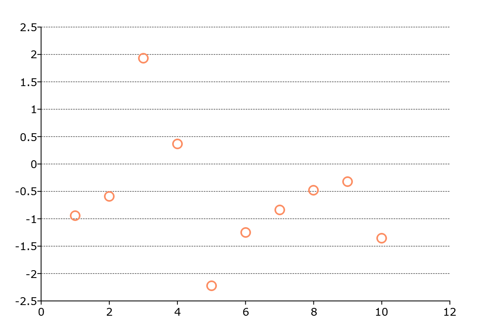

plotSetYGridPen
==============================================

Purpose
----------------
Controls the thickness, color, and style for the y-axis grid lines.

Format
----------------
.. function:: plotSetYGridPen(&myPlot, which_grid, thickness[, clr[, style]])

    :param &myPlot: A :class:`plotControl` structure pointer.
    :type &myPlot: struct pointer

    :param which_grid: The grid to modify, ``"major"``, ``"minor"``, or ``"both"``.
    :type which_grid: string

    :param thickness: the thickness of the specified y-axis grid lines in pixels.
    :type thickness: Scalar

    :param clr: Optional argument, name or rgb value of the new color for the specified y-axis grid lines.
    :type clr: string

    :param style: the style of the pen. Options include:

        .. include:: include/plotpenstyletable.rst

    :type style: Scalar

Examples
----------------

::

    // Declare plotControl structure
    struct plotControl myPlot;

    // Initialize plotControl structure
    myPlot = plotGetDefaults("scatter");

    // Set grid line to be 0.5 px, black, and dashed
    plotSetYGridPen(&myPlot, "major", 0.5, "Black", 2);

    // Create a scatter plot of random data
    plotScatter(myPlot, seqa(1, 1, 10 ), rndn(10, 1));

Remarks
--------

.. include:: include/plotattrremark.rst
.. include:: include/plotsetactiveyremark.rst

.. seealso:: Functions :func:`plotSetActiveY`, :func:`plotSetGridPen`, :func:`plotSetXGridPen`

