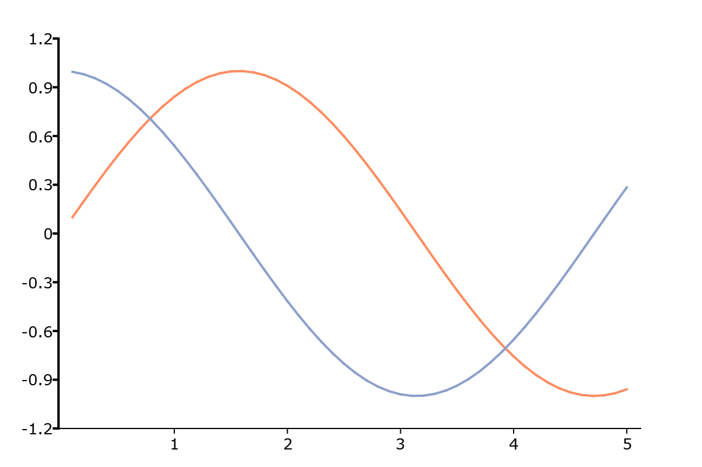

plotSetYPen
==============================================

Purpose
----------------
Sets the thickness, color, and style for the Y-Axis line.

Format
----------------
.. function:: plotSetYPen(&myPlot, thickness[, clr[, style]])

    :param &myPlot: A :class:`plotControl` structure pointer.
    :type &myPlot: struct pointer

    :param thickness: the thickness of the axis line in pixels.
    :type thickness: Scalar

    :param clr: Optional argument, name or rgb value of the new color for the axes.
    :type clr: string

    :param style: the style of the pen. Options include:

        .. include:: include/plotpenstyletable.rst

    :type style: Scalar

Examples
----------------

::

    // Declare plotControl structure
    struct plotControl myPlot;

    // Initialize plotControl structure
    myPlot = plotGetDefaults("xy");

    // Set axis to be 3 pixels wide and black
    plotSetYPen(&myPlot, 2, "black");

    // Create data
    x = seqa(0.1, 0.1, 50);
    y = sin(x)~cos(x);

    // Plot the data with the new line colors
    plotXY(myPlot, x, y);

Remarks
-------

.. include:: include/plotattrremark.rst

.. seealso:: Functions :func:`plotGetDefaults`, :func:`plotSetLineStyle`, :func:`plotSetAxesPen`, :func:`plotSetXPen`
