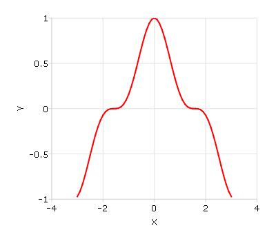
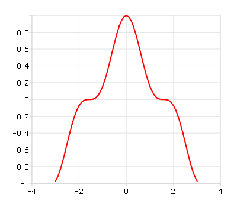

plotSetYTicCount
==============================================

Purpose
----------------
Sets the target number of major ticks on the y-axis of a 2-D plot.

Format
----------------
.. function:: plotSetYTicCount(&myPlot, num_ticks)

    :param &myPlot: A :class:`plotControl` structure pointer.
    :type &myPlot: struct pointer

    :param num_ticks: the target number of major ticks on the y-axis. GAUSS draws about this many ticks, at round values. Set to 0 to turn off the y-axis ticks and tick labels.
    :type num_ticks: scalar

Examples
----------------

::

    // Create some data to plot
    x = seqa(-3, 0.1, 61);
    y = cos(x).^3;

    // Declare and initialize plotControl structure
    struct plotControl myPlot;
    myPlot = plotGetDefaults("xy");

    // Aim for 5 ticks on the y-axis
    plotSetYTicCount(&myPlot, 5);

    // Plot the data, using the plotControl structure
    plotXY(myPlot, x, y);

    5 tick marks

The y-axis above has 5 major ticks, at -1, -0.5, 0, 0.5 and 1. The axis runs
from -1 to 1: the data reach 1 at the top, and the lowest point, -0.97, is
rounded out to -1 because that adds very little empty space.

If we aim for 11 ticks instead, there will be one major tick every 0.2 on the
y-axis. We can make that change like this:

::

    // Aim for 11 ticks on the y-axis
    plotSetYTicCount(&myPlot, 11);

    // Plot the data, using the plotControl structure
    plotXY(myPlot, x, y);

    11 tick marks

Remarks
-------

The number of ticks is a target, not an exact count. GAUSS draws about that
many ticks and keeps the tick values round, such as 1, 2, 2.5 or 5 times a power
of 10, so the number drawn can differ from the number requested. For instance,
in the example above, 10 ticks would need a spacing of 0.222, so GAUSS draws the
same 11 ticks, every 0.2.

* If the y-axis range is set automatically from the data, the axis ends at the
  data. An end is rounded out to the next tick only when that adds very little
  empty space (at most 5% of the range of the data), so an end is labeled only
  when it falls on a tick. For example, for data from -27 to 27, requesting
  4, 5, 6 or 7 ticks gives 5 ticks, at -20, -10, 0, 10 and 20, and requesting
  8 to 11 ticks gives 11 ticks, at -25, -20, ..., 25. The axis runs from -27
  to 27 in both cases.

* If the y-axis range is set with :func:`plotSetYRange`, the range is drawn
  exactly as given. The ends of the range are labeled only when they
  fall on a tick. When the requested count divides the range evenly at round
  values, that count is used: for a range of 0 to 1, 5 ticks gives 0, 0.25,
  0.5, 0.75 and 1, and 6 ticks gives 0, 0.2, 0.4, 0.6, 0.8 and 1.

* Otherwise, whether or not the range is set, GAUSS uses the round tick
  values whose number is nearest the request. If two choices are equally
  near, the one with more ticks is used.
  For a range of -30 to 30, 4 ticks gives 3 ticks, at -20, 0 and 20, and
  5 ticks, which lies halfway between 3 and 7, gives 7 ticks, at -30, -20,
  ..., 30.

* At most 11 ticks are drawn, and a request for more than 11 is treated as 11;
  at least 2 are drawn, so a request for 1 is treated as 2.
  For a range of -30 to 30, 10, 11 or 12 ticks gives 7 ticks, every 10, because
  the next round spacing, 5, would need 13.

* If the graph is too small for the requested number of tick labels to fit,
  fewer are drawn.

* If you zoom the graph, the requested count stays the target, and GAUSS places
  round ticks inside the visible range.

* If a tick interval is also set with :func:`plotSetYTicInterval`, the interval
  is used and the tick count is ignored.

For exact control of the tick positions, use :func:`plotSetYTicInterval`, which
sets the distance between ticks and the first labeled value.

.. include:: include/plotattrremark.rst
.. include:: include/plotsetactiveyremark.rst

.. seealso:: Functions :func:`plotSetYTicInterval`, :func:`plotSetYRange`, :func:`plotSetXTicCount`, :func:`plotSetYLabel`
