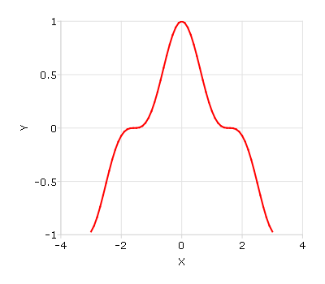

plotSetYTicCount
==============================================

Purpose
----------------
Controls the number of major ticks on the y-axis of a 2-D plot.

Format
----------------
.. function:: plotSetYTicCount(&myPlot, num_ticks)

    :param &myPlot: A :class:`plotControl` structure pointer.
    :type &myPlot: struct pointer

    :param num_ticks: the number of major ticks to place on the y-axis.
    :type num_ticks: scalar

Examples
----------------

::

    // Create some data to plot
    x = seqa(-3, 0.1, 61);
    y = x.^3 + rndn(rows(x), 1);

    // Plot the data
    plotXY(x, y);

    5 tick marks

will produce a graph that looks similar to the one above, with 5 major tick marks on the y-axis. If we use 11 tick marks, there will be one
major tick for 0.2 on the y-axis. We can make that change like this:

::

    // Declare and initialize plotControl structure
    struct plotControl myPlot;
    myPlot = plotGetDefaults("xy");

    // Set the y-axis to have 11 tick marks
    plotSetYTicCount(&myPlot, 11);

    // Plot the data, using the plotControl structure
    plotXY(myPlot, x, y);

.. figure:: _static/images/gauss15_psytc11.png
    :scale: 50%

    11 tick marks

Remarks
-------

Note that :func:`plotSetYTicCount` does not provide complete control over the
y-axis ticks. If the number of y-ticks requested would cause an odd tick
interval, GAUSS will create a number of ticks that will provide more even
spacing. For instance, in the example above, 11 ticks gave a space
between ticks of 0.2. If we chose 10 ticks, the spacing between ticks would
be 0.222. In that case, GAUSS would instead draw 10 ticks for a more even
appearance.

.. include:: include/plotattrremark.rst
.. include:: include/plotsetactiveyremark.rst

.. seealso:: Functions :func:`plotSetXTicInterval`, :func:`plotSetXLabel`

