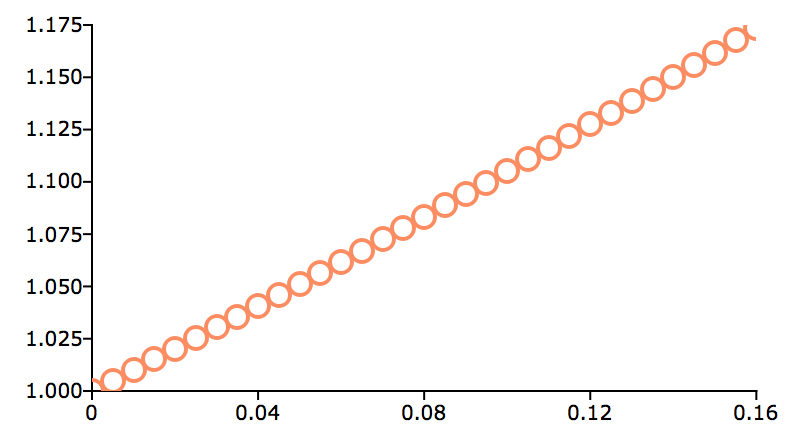

plotSetYticLabel
==============================================

Purpose
----------------
Controls the formatting and angle of y-axis tick labels for 2-D graphs.

Format
----------------
.. function:: plotSetYticLabel(&myPlot, fmt[, angle])

    :param &myPlot: A :class:`plotControl` structure pointer.
    :type &myPlot: struct pointer

    :param fmt: the desired formatting for the y-axis tick labels. If a 2x1 string array is passed in, the first element of *fmt* will control the left y-axis and the second element will control the right y-axis. :func:`sprintf` style formatting strings are supported. See Remarks below for more information.
    :type fmt: string or 2x1 string array

    :param angle: Optional argument, the angle in degrees at which to display the y-axis tick labels.
    :type angle: Scalar

Examples
----------------

Basic usage
+++++++++++

::

    // Declare and initialize plotControl structure
    struct plotControl myPlot;
    myPlot = plotGetDefaults("scatter");

    x = seqa(0, 0.005, 33);
    y = exp(x);

    // Set the Y-tick format to be decimal
    // with three places after the decimal point,
    // i.e. 1.050, 1.010, etc, for all tick labels
    plotSetYticLabel(&myPlot, "%.3f");

    // Draw the scatter plot
    plotScatter(myPlot, x, y);

The code above produces a graph with Y-tick labels like the image below:

    Y-tick labels

Changing to format string to ``"%g"`` will change the labels to appear like this:

::

    1.175
    1.15
    1.125
    1.1
    1.075
    1.05
    1.025

Changing to format string to ``"%.3e"`` will change the labels to appear like this:

::

    1.175e+00
    1.150e+00
    1.125e+00
    1.100e+00
    1.075e+00
    1.050e+00
    1.025e+00

Left and right y-axis formatting.
+++++++++++++++++++++++++++++++++

::

    // Create 2 vectors to plot
    temperature = { 14,
                    31,
                    27,
                    19,
                    22 };

    pct = { 6.3,
            10.4,
            13.2,
            80.7,
            28.5 };

    X = seqa(1, 1, 5);

    // Declare plotControl structure and fill
    // with default values for 'xy' plots
    struct plotControl myPlot;
    myPlot = plotGetDefaults("xy");

    // Use the left y-axis for the first line
    // and the right y-axis for the second line
    plotSetWhichYAxis(&myPlot, "left" $| "right");

    /*
    ** Set the format for the tick labels
    ** of each y-axis
    **
    ** "%d°" - Print the numbers as integers, followed by
    **             the degree symbol (° is HTML).
    **
    ** "%.1f%%" - Print one number after the decimal, followed by
    **            a percent sign.
    */

    fmt =  "%d°" $| /* format for left y-axis */
          "%.1f%%";     /* format for right y-axis */

    plotSetYTicLabel(&myPlot, fmt);

    // Draw the plot using the settings applied above
    plotXY(myPlot, X, temperature ~ pct);

This will give axes labels which look similar to below:

::

    Left y-axis 32°    Right y-axis 90.0%
                28°                 80.0%

Remarks
-------

The parameters of a :func:`sprintf` style format string are:

-  precision - a literal scalar numeral, the number of digits after the decimal point
-  format type - one of the following letters:

   === ==================
   d   integer
   e   scientific notation
   f   floating point/decimal
   g   either scientific or decimal, whichever is most compact
   === ==================

The format of the format string is:

::

   "%.<precision><format type>"

Below are some examples of different format strings and how they would
represent :math:`\pi`

======= ==================
"%.2f"  3.14
"%.4f"  3.1415
"%.2e"  3.14e+00
"%.2g"  3.14
"%d"    3
======= ==================

.. include:: include/plotattrremark.rst

.. seealso:: Functions :func:`dttostr`, :func:`strtodt`, :func:`plotSetYLabel`, :func:`plotSetXTicInterval`, :func:`plotSetTicLabelFont`

