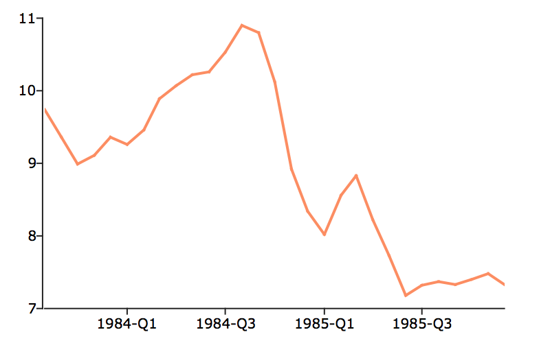

plotTSHF
==============================================

Purpose
----------------
Plots high-frequency and irregularly spaced time series data.

Format
----------------
.. function:: plotTSHF([myPlot, ]date_vec, label_unit, y)

    :param myPlot: Optional argument, a :class:`plotControl` structure.
    :type myPlot: struct

    :param date_vec: containing the dates for each observation in the *y* . The dates in *date_vec* are **required** to be:

        - In POSIX time/date format i.e. seconds since Jan 1, 1970.
        - Sorted, increasing.

        However, the dates in *date_vec* **may be**:

        - Irregularly spaced
        - Any frequency which can be represented by DT Scalar format, such as by year, quarter, month, week, day, hour, minute, second or millisecond.

    :type date_vec: Nx1 vector

    :param label_unit: containing the frequency with which to display the x-axis tick labels. Valid options include:

        - "milliseconds"
        - "seconds"
        - "minutes"
        - "hours"
        - "days"
        - "months"
        - "quarters"
        - "years"

    :type label_unit: string

    :param y: Each column contains the Y values for a particular line.
    :type y: Nx1 or NxM matrix

Examples
----------------

Basic TS plot with tick labels in terms of minutes
++++++++++++++++++++++++++++++++++++++++++++++++++

::

    // Dates in DT Scalar format for readability
    // October 09, 2008 6:30:00 - 6:32:30
    dt = { 20081009063000,
           20081009063030,
           20081009063100,
           20081009063130,
           20081009063200,
           20081009063230 };

    // Convert dates to seconds since epoch for plotTSHF
    dt = dttoutc(dt);

    // Some random data to plot
    y = rndu(rows(dt), 1);

    // Plot the data, with tick labels
    // in terms of seconds
    plotTSHF(dt, "minutes", y);

Plot Forex tick data with custom X-tick labels
++++++++++++++++++++++++++++++++++++++++++++++

::

    // Create file name with full path
    file = getGAUSSHome("examples/eurusd_tick.csv");

    // Load dates into df from file
    // Dates format looks like: "20081031 125145000"
    dt_forex = loadd(file, "date");
    
    // Shorten span
    dt_gr = dt_forex[1:20];
    
    // Load bid and ask quotes
    y = loadd(file, "bid + ask");
    y = y[1:rows(dt_gr), .];

    // Declare plotControl structure
    // and fill with default settings
    struct plotControl myPlot;
    myPlot = plotGetDefaults("xy");

    // Create an X-tick label every 15 seconds
    // Set the first tick label at:
    // October 31st, 2008 at 45 seconds after midnight
    first_label = asDate("2008 10 31 12:52", "%Y %m %d %H:%M");
    plotSetXTicInterval(&myPlot, 15, first_label);

    // Draw the time series plot
    plotTSHF(myPlot, dt_gr, "seconds", y);

T-bill plot with full date vector
+++++++++++++++++++++++++++++++++

::

    // Create file name with full path
    file = getGAUSSHome("examples/tbill_3mo.xlsx");

    // Load date vector and tbill data
    x = loadd(file, "obs_date + tbill_3m");

    // Separate date vector and tbill data
    date_vec = dttoutc(x[., 1]);
    y = x[ ., 2 ];

    // Specify that tick labels should be
    // on years, even though the data is monthly
    label_unit = "years";

    // Draw the time series plot
    plotTSHF(date_vec, label_unit, y);

Daily data with full date vector
++++++++++++++++++++++++++++++++

::

    // Fully pathed file name
    fname = getGAUSSHome("examples/xle_daily.xlsx");

    // Load all observations from variables,
    // 'Date' and 'Adj Close'
    data = loadd(fname, "Date + Adj Close");

    // Filter to include observations before 2018
    data = selif(data, data[., "Date"] .< "2018");

    // Draw plot of this daily data, specifying
    // that the X-tick labels should be set in
    // terms of months
    plotTSHF(data[., "Date"], "months", data[., "Adj Close"]);

Time Series Plot With Custom X-ticks
++++++++++++++++++++++++++++++++++++

::

    // Create file name with full path
    file = getGAUSSHome("examples/tbill_3mo.xlsx");

    // Load data
    data = loadd(file);
    
    // Filter to include data prior to 1986
    // and after 1983 Q4
    data = selif(data, data[., "obs_date"] .< "1986" .and data[., "obs_date"] .> "1983-07");

    // Declare 'myPlot' to be a plotControl structure
    // and fill it with 'xy' default settings
    struct plotControl myPlot;
    myPlot = plotGetDefaults("xy");

    // Place first x-tick mark at 1984 month 1 and draw one every 2 quarters
    // Note that we pass in the first_labeled date in posix format
    plotSetXTicInterval(&myPlot, 2, asDate("1984")));

    // Display only 4 digit year on x-tick labels
    plotSetXTicLabel(&myPlot, "YYYY-QQ");

    // Draw time series plot, using settings in 'myPlot'
    plotTSHF(myPlot, data[., "obs_date"], "quarters", data[., "tbill_3m"]);

Remarks
-------

Formatting for the x-tick labels can be set with the function
:func:`plotSetXTicLabel`. If a :class:`plotControl` structure is not passed in to
:func:`plotTSHF`, or the format specifier is not set with :func:`plotSetXTicLabel` the
default formatting based on the time label unit and is as follows:

=============== =====================
"years"         "YYYY"
"quarters"      "YYYY-QQ"
"months"        "YYYY-MO"
"days"          "MO-DD"
"hours"         "HH:MI"
"minutes"       "HH:MI"
"seconds"       "HH:MI:SS"
"milliseconds"  "HH:MI:SS.zzz"
=============== =====================

By default missing values in the *y* variable will be represented as gaps in the line.

.. seealso:: Functions :func:`plotSetXTicLabel`, :func:`plotSetXTicInterval`, :func:`plotScatter`, :func:`plotTS`, :func:`plotTSLog`

