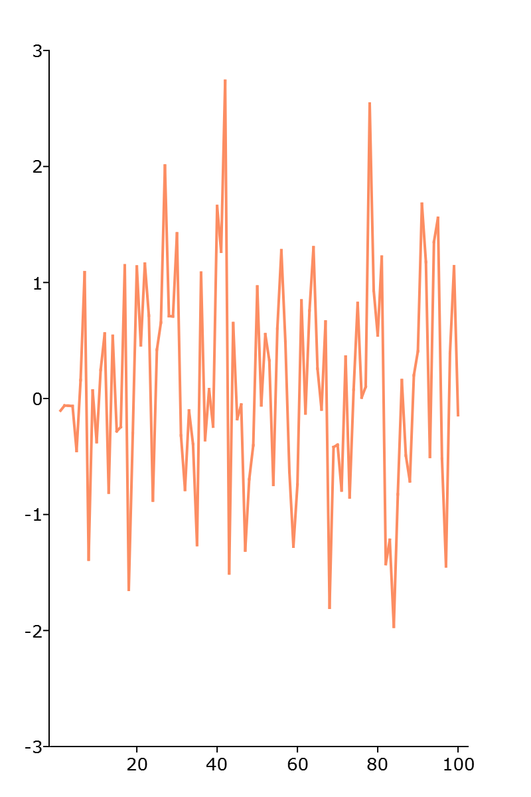

plotXY
==============================================

Purpose
----------------

Graphs X vs. Y using Cartesian coordinates.

Format
----------------
.. function:: plotXY([myPlot, ]x, y)
              plotXY([myPlot, ]dataset, formula)

    :param myPlot: Optional argument, a :class:`plotControl` structure.
    :type myPlot: struct

    :param x: Each column contains the X values for a particular line.
    :type x: Nx1 or NxM matrix

    :param y: Each column contains the Y values for a particular line.
    :type y: Nx1 or NxM matrix

    :param dataset: name of the dataframe in memory.
    :type dataset: dataframe

    :param formula: formula string of the model to be plotted.
        E.g ``"y ~ X1"``, ``y`` is the name of dependent variable to be plotted on the y-axis ``X1`` is the names of the variable to be plotted on the x-axis;

        E.g ``"y ~ X1 + by(X2)"``, ``by(X2)`` specifies that the data should be separated into different lines based on the groups defined by ``X2``.

    :type formula: string
    
Examples
----------------

Basic XY plot
++++++++++++++

::

  // Random y data
  y = rndn(100, 1);

  // Sequential x data
  x = seqa(1, 1, rows(y));

  // Plot using XY plot
  plotXY(x, y);

Basic formula string
++++++++++++++++++++++++++++
  .. figure:: _static/images/plotxy-cr.png
     :scale: 50 %

  ::

    // Load data
    clotting_time = loadd(getGAUSSHome $+ "examples/clotting_time.dat");

    // Plot using XY plot
    plotXY(clotting_time, "plasma ~ lot1")

Remarks
-------

By default missing values in *y* will be represented as gaps
in the line.

.. seealso:: Functions :func:`plotLogX`, :func:`plotLogLog`, :func:`plotScatter`
