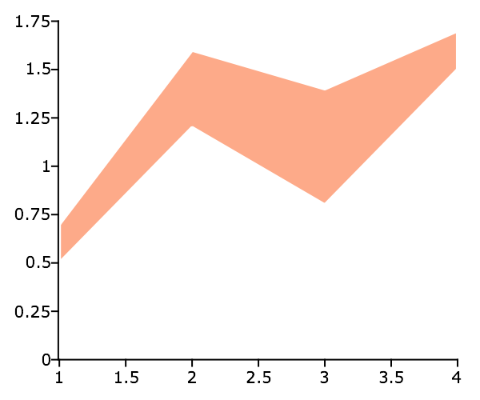
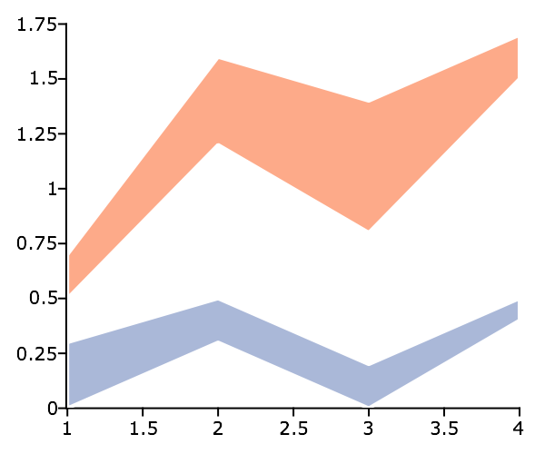

plotXYFill
==============================================

Purpose
----------------

Creates an area plot between sets of 2-D vectors.

Format
----------------
.. function:: plotXYFill([myPlot, ]x, y_bottom, y_top)

    :param myPlot: Optional argument, a :class:`plotControl` structure
    :type myPlot: struct

    :param x: The X values for a particular line.
    :type x: Nx1 matrix

    :param y_bottom: Each column contains the Y values for the bottom of a filled area. If *y_bottom* contains more than
        one column, each column will be the bottom for a different area.
    :type y_bottom: Nx1 or NxM matrix

    :param y_top: Each column contains the Y values for the top of a filled area. If *y_top* contains more than
        one column, each column will be the top for a different area.
    :type y_top: Nx1 or NxM matrix

Examples
----------------

One set of vectors
+++++++++++++++++++

::

    x = { 1, 2, 3, 4 };
    y_bottom = { 0.5,
                 1.2,
                 0.8,
                 1.5 };
    y_top    = { 0.7,
                 1.6,
                 1.4,
                 1.7 };

    // Draw an area plot between the vectors
    plotXYFill(x, y_bottom, y_top);

Two sets of vectors
+++++++++++++++++++

::

    x = { 1, 2, 3, 4 };
    y_bottom = { 0.5   0,
                 1.2 0.3,
                 0.8 0.0,
                 1.5 0.4 };
    y_top    = { 0.7 0.3,
                 1.6 0.5,
                 1.4 0.2,
                 1.7 0.5 };

    // Draw an area plot between the pairs of vectors
    plotXYFill(x, y_bottom, y_top);

.. seealso:: Functions :func:`plotArea`, :func:`plotSetFill`, :func:`plotXY`
