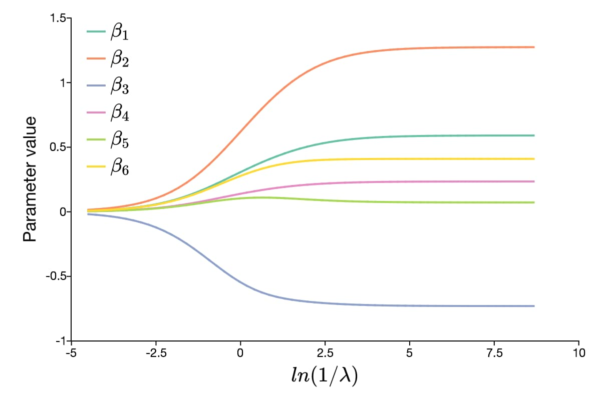
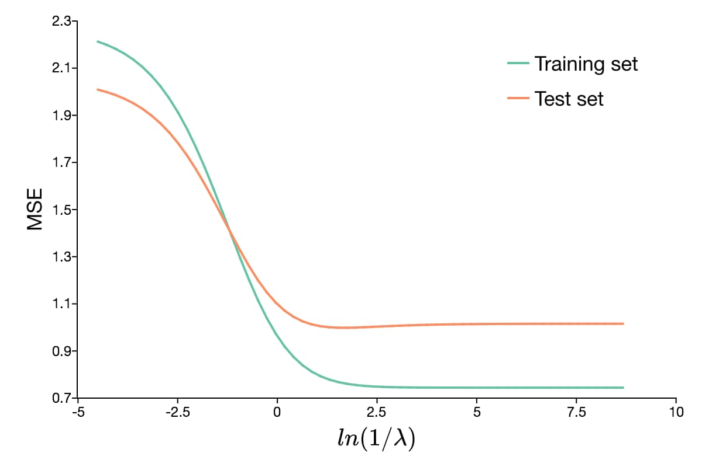

ridgeFit
===================

Purpose
----------------
Fit a linear model with an L2 penalty.

Format
------------
.. function:: mdl = ridgeFit(y, X, lambda)

    :param y: The target, or dependent variable.
    :type y: Nx1 vector

    :param X: The model features, or independent variables.
    :type X: NxP matrix

    :param lambda: The L2 penalty parameter(s).
    :type lambda: Scalar, or Kx1 vector

    :return mdl: An instance of a :class:`ridgeModel` structure. An instance named *mdl* will have the following members:

        .. csv-table::
            :widths: auto

            "mdl.alpha_hat","(*1 x nlambdas vector*) The estimated value for the intercept for each provided *lambda*."
            "mdl.beta_hat","(*P x nlambdas matrix*) The estimated parameter values for each provided *lambda*."
            "mdl.mse_train","(*nlambdas x 1 vector*) The mean squared error for each set of parameters, computed on the training set."
            "mdl.lambda","(*nlambdas x 1 vector*) The *lambda* values used in the estimation."

    :rtype mdl: struct

Examples
-----------

Example 1: Basic Estimation and Prediction
+++++++++++++++++++++++++++++++++++++++++++++

::

    new;

    library gml;

    // Specify dataset with full path
    dataset = getGAUSSHome() $+ "pkgs/gml/examples/qsar_fish_toxicity.csv";

    // Load dependent and independent variable
    y = loadd(dataset, "LC50");
    X = loadd(dataset, ". -LC50");

    // Split data into training sets
    y_test = y[1:636];
    X_test = X[1:636,.];
    y_train = y[637:rows(y)];
    X_train = X[637:rows(X),.];

    // Declare 'mdl' to be an instance of a
    // ridgeModel structure to hold the estimation results
    struct ridgeModel mdl;

    // Set lambda vector
    lambda = seqm(90, 0.8, 60);

    // Estimate the model with default settings
    mdl = ridgeFit(y_train, X_train, lambda);

After the above code, *mdl.beta_hat* will be a :math:`6 \times 60` matrix, where each column contains the estimates for a different lambda value. The graph below shows the path of the parameter values as the value of lambda changes.

Continuing with our example, we can make test predictions like this:

::

    // Make predictions on the test set
    y_hat = X_test * mdl.beta_hat + mdl.alpha_hat;

After the above code, *y_hat* will be a matrix with the same number of observations as *y_test*. However, it will have one column for each value of lambda used in the estimation. We can compute the mean-squared error (MSE) for each of our predictions with the following code:

::

    // Compute MSE for each prediction
    mse_test = meanc((y_test - y_hat).^2);

Below is a plot of the change in MSE with the changes in lambda.

Remarks
-------------

Each variable (column of *X*) is centered to have a mean of 0 and scaled to have unit length, (i.e. the vector 2-norm of each column of *X* is equal to 1).

.. seealso:: :func:`lassoFit`
