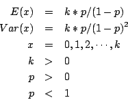

rndnb
==============================================

Purpose
----------------

Computes pseudo-random numbers with negative binomial distribution.

Format
----------------
.. function:: x = rndnb(r, c, k, p)

    :param r: number of rows of resulting matrix.
    :type r: scalar

    :param c: number of columns of resulting matrix.
    :type c: scalar

    :param k: ExE conformable with r x c resulting matrix, "event" parameters for negative binomial distribution.
    :type k: MxN matrix

    :param p: ExE conformable with r x c resulting matrix, "probability" parameters for negative binomial distribution.
    :type p: KxL matrix

    :return x: negative binomial distributed pseudo-random numbers.

    :rtype x: RxC matrix

Remarks
-------

The properties of the pseudo-random numbers in *x* are:

Source
------

random.src

